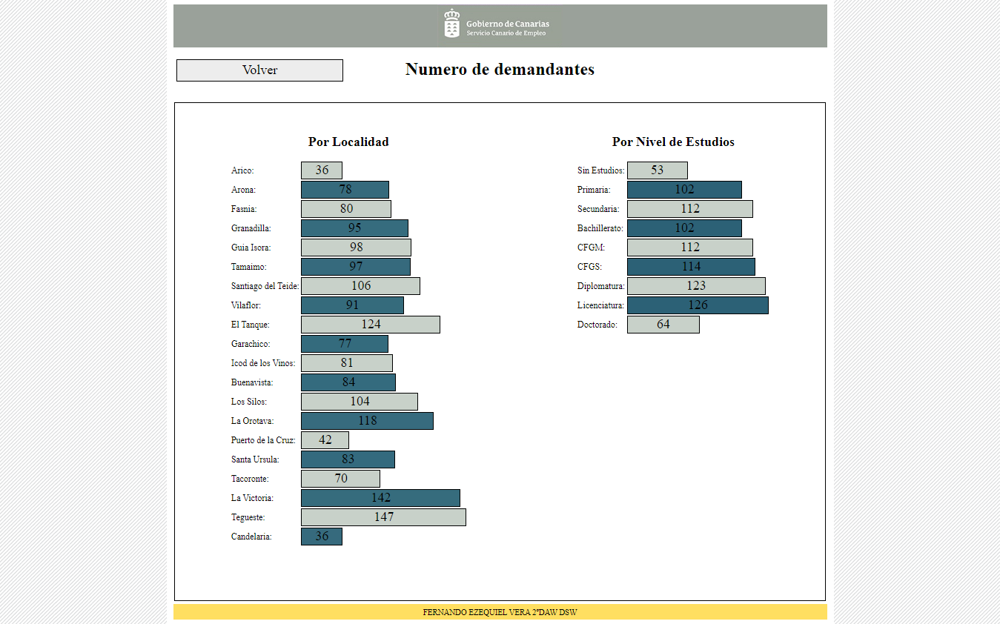
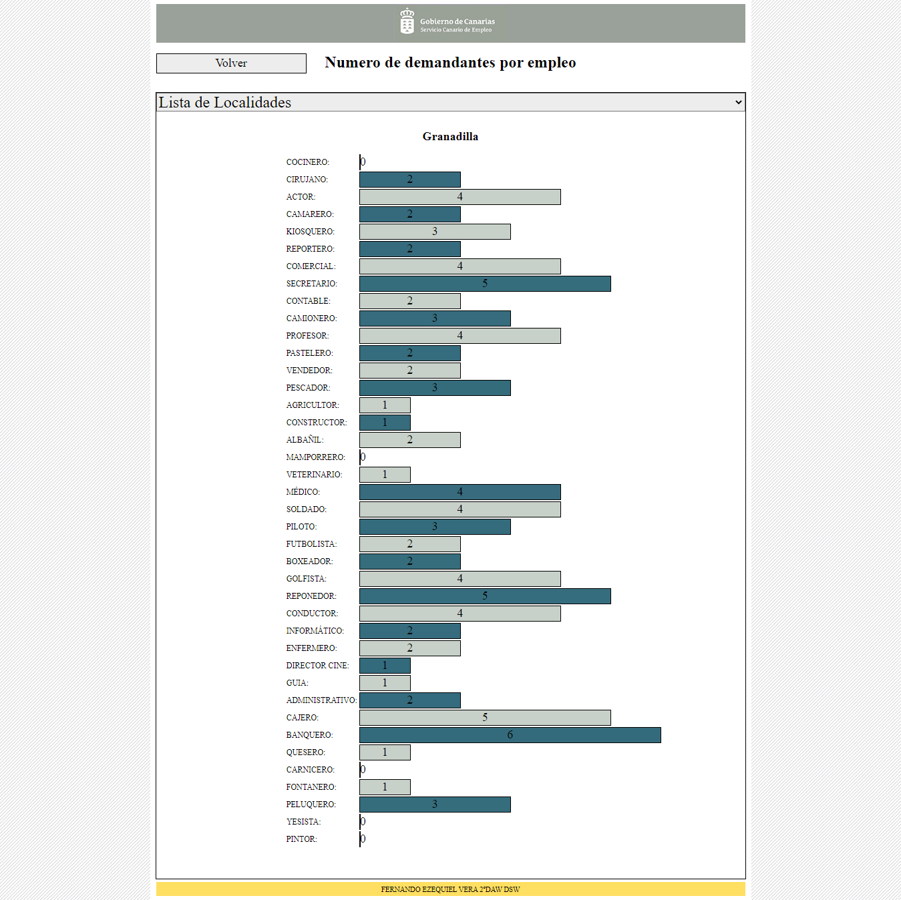
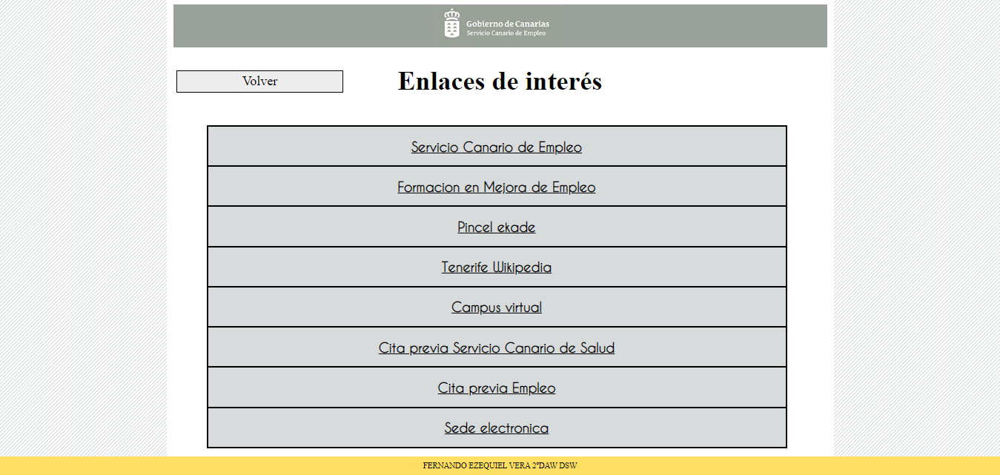
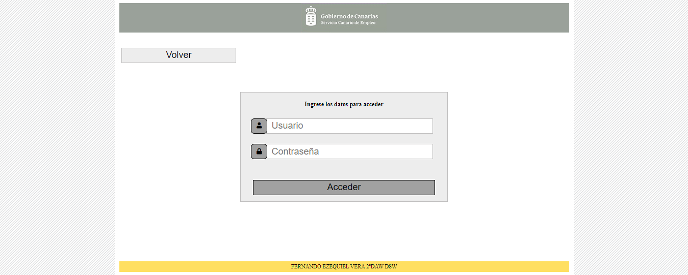
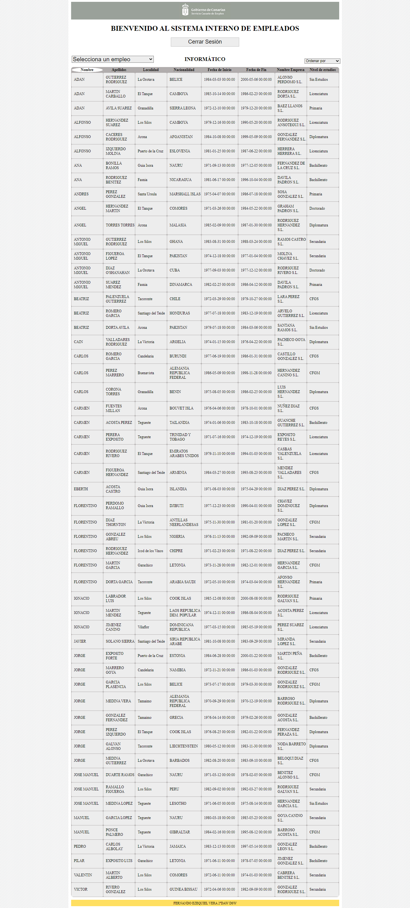

# INDEX 📋

- **GobCanWebSimulation** 💼
  - [**About project**](#about-project) ⭐
  - [**Preview**](#preview) 🔍
  - [**Screenshots**](#screenshots) 📷
  - [**Technologies**](#technologies) 💻
  - [**Setup**](#setup) 🔧
  - [**Usage**](#usage) 📋
  - [**Status**](#status) ⚪
  - [**Contact**](#contact) 📞


# About project⭐


**Date**: November, 2019.   
**Duration**: 5 Days.


This project was developted in order to practice with **PHP 7**.
But it also has **CSS** and **XML** to make it works correctly.
I used XML for save websites's urls and I 'was not allowed' to use JavasCript.

# Preview🔍

*Index.php,Tenerife.php,Enlaces.php,Interno.php* files/pages preview

 

*Localidad.php* file/page preview

 

 *Interno.php* file/page preview 

 


# Screenshots📷

>
>
>
>
>


# Technologies💻

- **HTML**
- **CSS**
- **PHP 7.4.5**
- **XML**
- [**XAMPP(Apache+MySQL)**](https://www.apachefriends.org/index.html)


# Setup🔧

Install PHP 7 and in my case XAMPP for Apache server and MySQL.

```bash
git clone https://github.com/Hukex/GobCanWebSimulation.git
```

Now just save the folder cloned on **xampp/htdocs** it is usually on C:\\

For Database have to create a new DB on phpmyadmin and import the file demantantes.sql 


 

# Usage📋
Start Apache and MySQL on XAMPP.

 

Basically the main page (index) is **index.php**, if you had done the past step just open your browser and write on the url the next

**localhost/*foldercloned***

It will load index.php if you have XAMPP Apache ports on 80, IF YOU DON'T then change url ports localhost:NUMBERPORT/*foldercloned***

Now you can enjoy it.


# Status⚪

**Finished.**

It was for practice so it's done.

# Contact📞

My name is Fernando, you can contact me if you desire!


## 😃 Thanks for reading. 👋

